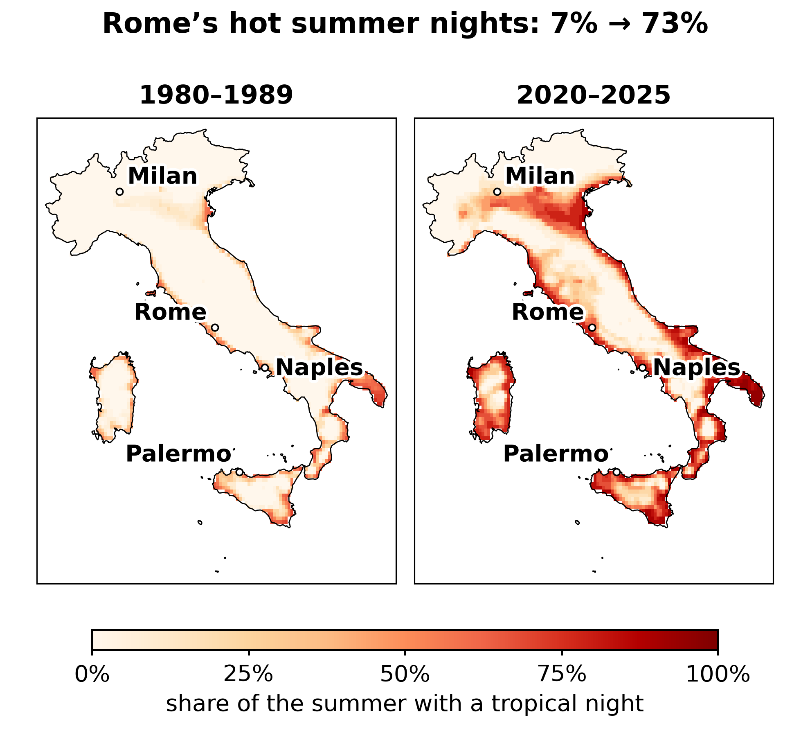
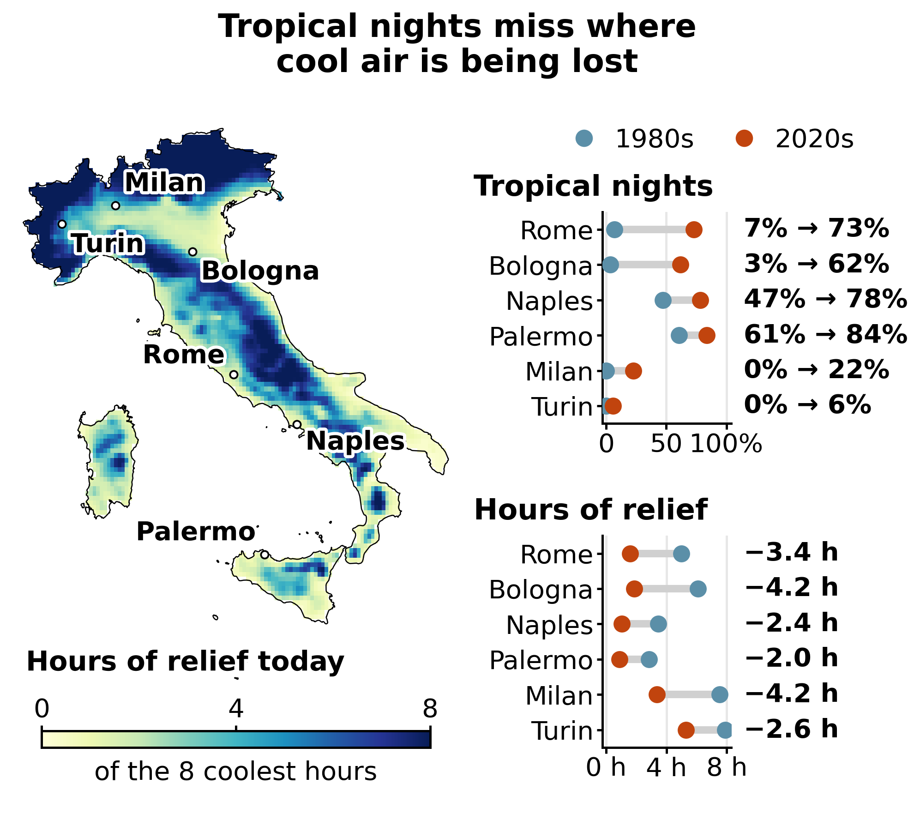
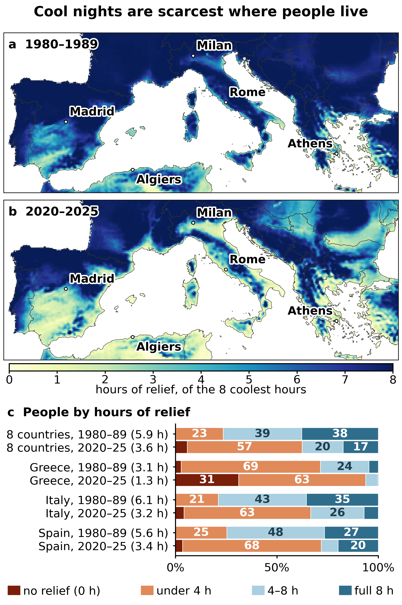

<!-- BIT · tropical-nights · en · 2026-10-05 -->

# Southern Europe has stopped cooling down at night

> **BIT VERDICT #001**
> 
> - **The Claim:** Southern European nights have stopped cooling down.
> - **The Catch:** The standard metric — tropical nights — is a yes-or-no count. It only notices a night once its last cool hour has gone, so a night that cools for an hour and one that stays cool till dawn score the same.
> - **The Reality:** Measuring hours of relief instead shows the northern lowlands — Milan, Bologna — losing more cool night air than the southern coasts, and puts the loss for the average southern European at **2.3 hours a night, give or take half an hour — from 5.9 to 3.6 of a possible eight — the equivalent of 26 full cool nights every summer**.

*Hot nights carry a health cost of their own, separate from the day’s — and the number we use to count them is quietly failing. This article focuses on Italy and expands to the Southern European EU members; the same test can be run anywhere ERA5-Land reaches.*

---

## BIG — the nights stopped cooling

As a large-framed guy with mild insomnia who suffers terribly in the heat, this isn’t abstract science to me. I spent a month this summer sleeping peacefully without air conditioning in Troina, a small mountain town in Sicily, while my family suffered through relentless heatwaves back home in Crema, not far from Milan, right in the heart of the Po Valley. That contrast turned out to be a window onto a regional shift, and measuring it is what this article does.

The unbearably hot nights we lived through in southern Europe this summer have a name: tropical nights. A tropical night is a night when the temperature never drops below 20 °C. It sounds like a holiday brochure. It isn’t. Your body lowers its core temperature to fall asleep and to stay asleep, and it does that by shedding heat into the air around you. When the air stays above 20 °C all night, that mechanism stalls. You don’t recover from the day’s heat. Research on heatwaves bears this out: a hot night is bad for your health in its own right, not just as the end of a hot day. That’s why heatwave alerts look at the nights too — after a hot day, a cool night lets the body recover, and a hot night doesn’t.

So here is my empirical observation. I took public data from ERA5-Land, the European reanalysis that reconstructs past weather on a 9 km grid, and compared the June-to-August summers of 2020–2025 (so, excluding this crazy last summer) with those of 1980–1989 across Italy. The baseline is arbitrary: I was born in 1983 and wanted to compare with my childhood. It happens to match the framing of recent scientific publications. One caveat belongs next to every number that follows: ERA5-Land models fields, not asphalt, so it carries no urban heat island, and every figure here is a floor.

*Figure 1 — Italy, share of the summer whose average night stays above 20 °C. Left: 1980–1989. Right: 2020–2025. ERA5-Land, 9 km grid, June–August.*

> **THE NUMBERS**
> 
> - **6% → 33%** — the share of Italy where the typical summer night now stays above 20 °C
> - **73%** — the share of the summer that is a tropical night in Rome today; in the 1980s it was 7%
> - **28%** — the share of the summer the area around Crema now spends in tropical nights; Troina’s is 6%, and both were 0% in the 1980s

In the 1980s, **6% of Italy** had a typical summer night that stayed above 20 °C. Today it is **33%**. A third of the country. Rome went from 7% of the summer to 73% — five nights a week. Milan, which had none at all, is now at 22%, about a week of every summer month.

The data agree with the anecdote. In the 1980s neither the area around Troina nor the area around Crema had any tropical nights; today Crema spends **28%** of the summer in them, Troina 6%. But a count of tropical nights only notices a night once it stays hot all the way through — and there the number stopped working.

## IF — the number we use goes blind

A tropical night is a yes-or-no thing. Either the night dropped below 20 °C at some point or it didn’t. So a night that cools off for barely an hour before dawn and a night that stays cool from midnight to morning both count as ‘not tropical’ — yet one gives you a good night’s rest and the other hardly any. The count only notices a night once its last cool hour has gone; everything that happens on the way there is invisible to it.

So I used a simpler measure instead. Take the eight coldest hours of the day — roughly the window you would sleep in. Count how many of them stay below 20 °C. Call it hours of relief. Eight is a good night; zero is a tropical night. Nothing is thrown away in between. It measures the availability of cool air, not sleep; nobody in this article measured how long anyone slept.

The same blind spot shows up over time. Because the count of tropical nights only notices a night once its last cool hour has gone, it misses change that stops short of that. Rome’s tropical nights have gone from 7% of the summer to 73% since the 1980s, Milan’s only from none to 22% — yet Milan has lost more cool air, 4.2 hours a night against Rome’s 3.4. Milan’s nights went from cool nearly all night to cool for less than half of it, and almost none of that counts as a tropical night. The same measure puts a number on the anecdote: in the 1980s the areas around Troina and Crema differed by less than an hour; today Crema gets 3.3 hours less a night than Troina.

*Figure 2 — Left: hours of relief across Italy today (2020–2025). Right, Tropical nights: in six of Italy’s largest cities, the share of the summer that is a tropical night, in the 1980s (blue) and today (red); Hours of relief: the same cities, with the relief lost printed at the right of each row. Cities are ordered by how much their tropical nights rose. ERA5-Land, June–August.*

> **THE PO VALLEY PARADOX**
> 
> - **Rome —** tropical nights from 7% of the summer in the 1980s to 73% today. Relief lost: **3.4 hours** a night.
> - **Milan —** tropical nights from none to 22% of the summer. Relief lost: **4.2 hours** — more than Rome.
> - **Turin —** tropical nights from none to 6% of the summer, barely a change — yet it still lost **2.6 hours** of relief a night.
> - **The takeaway —** the count sees nights crossing the line and misses nights emptying out below it. Both measures agree that Rome and Bologna have changed a lot; they part company over Milan and Turin, where the tropical-night count has barely moved while the cool hours drained away. The Po plain used to cool down properly at night in the 1980s; now it does not.

But might this just be an artefact of the data I collected, a coarse 9 km model?

> **WHAT THE LITERATURE SAYS**
> 
> - Vavassori, Žgela and Brovelli (*Applied Geomatics*, 2026) ran the same question over Italy on a 2.2 km reanalysis — twenty times finer than mine — alongside 100-plus quality-controlled stations from the Italian Air Force synoptic network, for 1981–2024. Of every heat indicator they tested, tropical nights rose fastest: around 6 to 7 days per decade, steepest below 500 m, in the lowlands where most people live. Finer grid, real thermometers, same direction. What it is *not* is a check on the specific comparison in this article: they fit a continuous trend across 44 years rather than setting two decades against each other, and they cover Italy alone. It corroborates the phenomenon, not my arithmetic.

## TRUE — and it is not just Italy

If this collapse in night-time cooling is taking hold in Italy, we should see it echoed across the entire northern Mediterranean arc. It does — and by weighting every grid cell by the number of people living in it, using the Eurostat statistical grid, we can quantify what the shift means for people rather than for territory. Altitude still helps; the trouble is that people mostly live in the lowlands.

*Figure 3 — (a, b) Hours of relief across the whole frame, 1980–1989 and 2020–2025, for every land cell ERA5-Land covers (June–August). (c) The eight Southern European EU countries together, and Greece, Italy and Spain: the population split into four bands by hours of relief, weighted by the Eurostat census grid 2021 (GISCO, 5 km); each label gives the average hours per person. The dark red band at the start of each bar is the tropical-night population — people whose average summer night never falls below 20 °C.*

The average person in Italy has lost **2.8 hours** of cool night air, going from 6.1 hours a night to 3.2 — put the other way, Italy keeps about half of what it had. In Spain the loss is **2.2 hours**, from 5.6 to 3.4. In Greece it is **1.8 hours** — and Greeks now average just **1.3 hours** a night, down from 3.1. Greece is where the scale runs out: its loss looks smaller than Italy’s only because it started with so little, and you cannot lose what you never had. Six summers set against ten is a small sample, so each country’s loss could be off by up to about three-quarters of an hour either way: Italy losing the most holds regardless, but whether Spain lost more than Greece does not.

In the 1980s, **four Italians in five** had at least four hours of relief (Figure 3, panel c). Today **two in three have less than four**. In Greece, **31% of the population** — one person in three — now lives where the average summer night is a true tropical night: it never drops below 20 °C at all. In the 1980s that was 3%.

Widen it to the eight Southern European EU member states fully captured in the Eurostat census grid — Portugal, Spain, Italy, Malta, Slovenia, Croatia, Greece and Bulgaria — and the picture holds. The average Southern European resident has gone from 5.9 hours of relief a night down to 3.6: a loss of 2.3 hours per person, across 135 million people.

Put the other way, southern Europe keeps three of every five hours of cool air it had. Southern Europeans getting less than four hours have gone from about one in four to more than three in five. Those still getting a full eight have more than halved, from almost two in five to about one in six.

> **THE NUMBERS**
> 
> - **5.9 → 3.6 hours** — cool night air a southern European gets, of a possible eight
> - **26 nights** — full cool nights lost per person, every summer — close to a third of it (between 20 and 32)
> - **308 million person-hours** — the same loss summed over 135 million people, every summer night
> - **7% of a lifetime’s nights** — what the lost cool nights add up to, if the rate never rises again (between about 6% and 9%)

The maps display the broader basin — including North Africa, Turkey and the Balkans — because atmospheric heat is not bounded by national borders. Those regions are excluded from the aggregate totals, however, because the EU census grid does not cover them.

I said at the start that I sleep badly. On a night that barely cools — the kind Crema now gets — someone like me falls asleep at four and wakes at seven. My answer this summer was to run from the plain to Troina: a privilege, not a plan, because most people cannot leave. For them the answer is air conditioning, which cools a room by pushing its heat out into the street, and [uses electricity to do it](https://doi.org/10.1787/9789264301993-en), much of it still made by burning fossil fuels — warming the neighbourhood tonight and the climate for the summers to come. The fix for one hot night feeds the next. The numbers in this article are about cool air, not rest. But that is what the missing hours of relief turn into, one night at a time, for the people who were already lying awake.

Sleeping badly leaves time for questions. I chose this particular one and Claude did the legwork, from the download scripts to the last map, while I kept sending it back whenever a number looked wrong; [the code and data](https://github.com/bigiftruebits/bit-001-tropical-nights) are there so you can do the same. A casual reader can stop here: what follows is the part every issue of this newsletter ends with, all the workings shown instead of asking for trust, as I explain in [a short manifesto](https://bigiftruebits.substack.com/p/manifesto).

---

## What this is and isn’t

- This is availability of cool air, not sleep. Nobody measured how long anyone slept. What changed is whether the conditions for sleeping well exist.
- The comparison is 2020–2025 (six summers) against 1980–1989 (ten summers), June to August. Six years is a short recent baseline; the warming carries roughly ±0.7 °C of sampling uncertainty in Italy and Spain and ±0.9 °C in Greece.
- Summer here means June to August, the standard meteorological summer, applied identically to both decades. It is the right window for the hottest part of the year: June has warmed more than any other month, by about 3.2 °C, and September least, by about 1.0 °C, so June now runs some 2 °C warmer than September where in the 1980s the two were level. But the sea stays warm into September, and coastal nights follow the sea, so leaving September out may understate night-time heat on the coast. September nights were not analysed; checking them would show whether the hot-night season now runs past the calendar summer.
- Every value here describes a grid cell about 9 km across — the area around a place, not its centre. So every city quoted was checked against the cells around it. Most hold up: Rome, Milan, Naples, Bari and Crema barely change within 15 km. Genoa does not. Its own cell is sea, and the land cells nearby run from under 2 hours of relief on the coast to a full 8 in the hills behind, so it is left out of Figure 2 rather than represented by a hillside. Troina’s surroundings are just as steep: the town sits inside its own cell, and the cells to its north and west agree with it, but that cell averages the ridge-top town together with the lower ground around it, and a 9 km grid cannot say whether the town itself runs cooler or warmer at night. Differences between cities of about half an hour or less are within this uncertainty and are not treated as findings.
- Hours of relief has a ceiling of its own. Once none of the eight coolest hours drops below 20 °C it reads zero, whether the night sits at 21 °C or at 27 °C — which is now the case for about a third of Greeks. It measures the loss of cool air well, but it cannot rank how hot the hottest nights have become; that would take a measure of how far above 20 °C they stay.
- “Share of summer” here means the share of summer months whose average night is tropical — not a count of individual nights. Real tropical-night counts are higher, because individual hot nights beat the monthly average.
- ERA5-Land has no cities in it. It models fields, not asphalt, so it carries no urban heat island. Real Milan, Rome, Madrid and Athens are hotter at night than shown here. Every number in this article is a floor.
- The 135-million aggregate covers Portugal, Spain, Italy, Malta, Slovenia, Croatia, Greece and Bulgaria. France, Austria, Romania, Hungary and Switzerland are cut by the map’s northern edge, so including them would mean averaging over half a country; the non-EU Balkans and North Africa have no comparable census grid. Malta rests on two grid cells and should be read as illustrative, not precise.

> **BIT — CARDS ON THE TABLE**
> 
> - **Model & code —** every script in this analysis, from the data download through the spatial joins and statistics to the charts, was written by Claude (Anthropic), working from my instructions; I set the questions and the framing. The analysis and the writing were done in a regular Claude chat between August and October 2026, which began with **Claude Opus 5** and ended with **Claude Opus 5.5** — when it switched was not recorded. A separate Claude chat edited the text to the series’ format, and the public repository was set up in Claude Code, almost entirely by **Claude Sonnet 5.5**. The data downloads ran on my own computer.
> - **Usage —** counted for setting up the public repository and its archive, done in Claude Code: 3.5 million effective tokens (Sonnet 5.5 3.47M, Opus 5.5 0.07M), about $7 at list prices. Not counted: the analysis and the writing, done in an ordinary Claude chat that cannot report tokens, and the editing to the series’ format, done in another chat. [The full count is in the repository](https://github.com/bigiftruebits/bit-001-tropical-nights/blob/main/USAGE.md).
> - **Bugs found and fixed in development —** a masked-array error that silently turned every sea cell into a real-looking zero; a country-boundary error that let 29% foreign territory into the “Italian” data; population cells snapping onto sea pixels and losing 10–16% of coastal residents; an arbitrary four-hour threshold abandoned once the full sensitivity was checked; an apparent hourly structure that turned out to be a reanalysis artefact, caught because it appeared at the same clock hour in three countries spanning an hour of solar time; a city whose own grid cell turned out to be sea, and so was being represented by a hillside 11 km inland; and, in review, several claims in the argument itself that did not survive checking; [the full log is in the repository](https://github.com/bigiftruebits/bit-001-tropical-nights/blob/main/NOTES.md). Each was caught. I cannot promise none remain.
> - **Data sources —** ERA5-Land monthly averages by hour of day (Copernicus Climate Change Service, CC BY; [doi:10.24381/cds.68d2bb30](https://doi.org/10.24381/cds.68d2bb30); described in Muñoz-Sabater et al., Earth System Science Data 13, 2021, [doi:10.5194/essd-13-4349-2021](https://doi.org/10.5194/essd-13-4349-2021)); Eurostat census grid 2021 (GISCO, 5 km; CC BY 4.0, © European Union, Eurostat; [ec.europa.eu/eurostat/web/gisco/geodata/grids](https://ec.europa.eu/eurostat/web/gisco/geodata/grids)); country outlines (Natural Earth, public domain; [naturalearthdata.com](https://www.naturalearthdata.com/)).
> - **Related peer-reviewed work —** Vavassori, Žgela & Brovelli, Applied Geomatics 18:84 (2026), [doi:10.1007/s12518-026-00734-x](https://doi.org/10.1007/s12518-026-00734-x): over Italy, with a finer reanalysis and weather stations, tropical nights rose fastest of all heat indicators — the same direction, as a 44-year trend rather than this article’s comparison of two decades. On nearby questions, Murage, Hajat & Kovats, Environmental Epidemiology (2017), [doi:10.1097/EE9.0000000000000005](https://doi.org/10.1097/EE9.0000000000000005), and Kim et al., Environmental Health Perspectives 131 (2023), [doi:10.1289/EHP11444](https://doi.org/10.1289/EHP11444), find that hot nights raise mortality independently of the day’s heat; de Munck et al., International Journal of Climatology 33 (2013), [doi:10.1002/joc.3415](https://doi.org/10.1002/joc.3415), and Salamanca et al., Journal of Geophysical Research: Atmospheres 119 (2014), [doi:10.1002/2013JD021225](https://doi.org/10.1002/2013JD021225), find that air-conditioning waste heat warms city streets, most of all at night. Both agree with what this article says.
> - **Code and data —** [github.com/bigiftruebits/bit-001-tropical-nights](https://github.com/bigiftruebits/bit-001-tropical-nights); archived, code and data together, at [doi:10.5281/zenodo.23158810](https://doi.org/10.5281/zenodo.23158810). From the shared data alone, all 68 checks reproduce the published values and every figure redraws.
> - **How to cite —** This is not a peer-reviewed publication. If you need to reference it anyway, cite the archived code and data: Gallotti, R. (2026). BIG IF TRUE #001: Southern Europe has stopped cooling down at night [Code and data]. Zenodo. [https://doi.org/10.5281/zenodo.23158810](https://doi.org/10.5281/zenodo.23158810)

*I would rather someone found a mistake than that nobody looked. [Code and data](https://github.com/bigiftruebits/bit-001-tropical-nights) are open, and published with every issue.*
