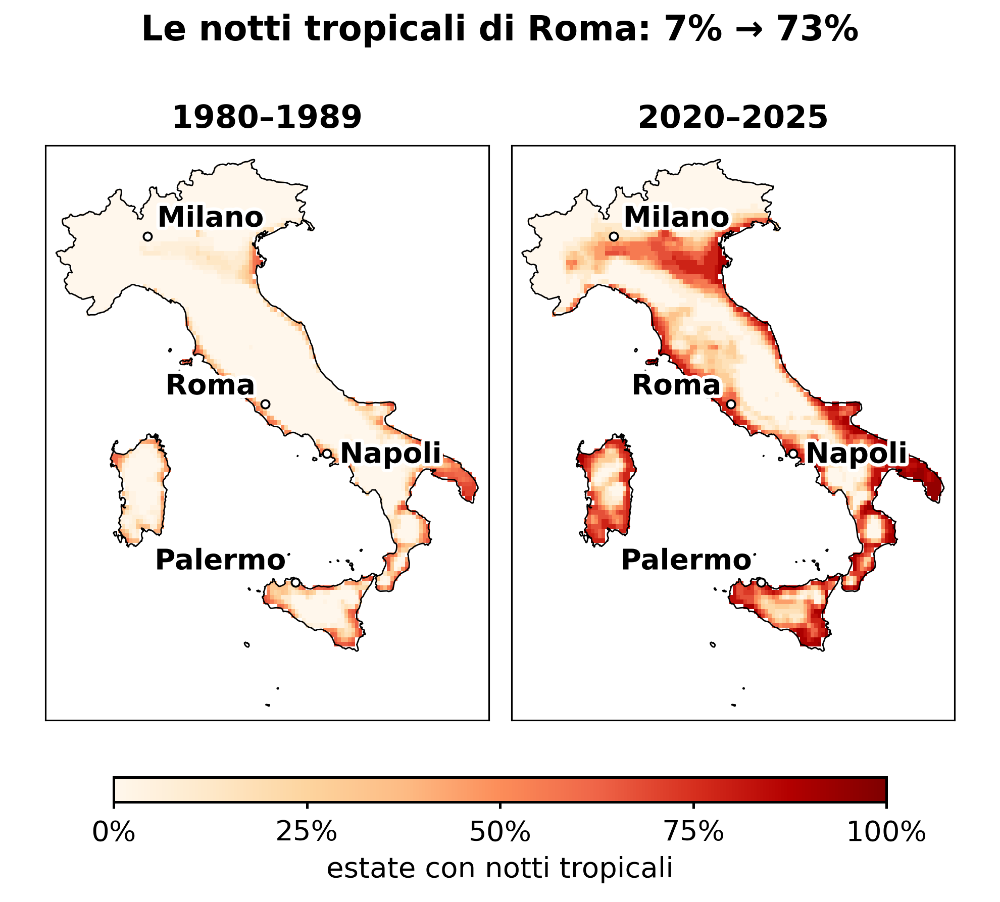
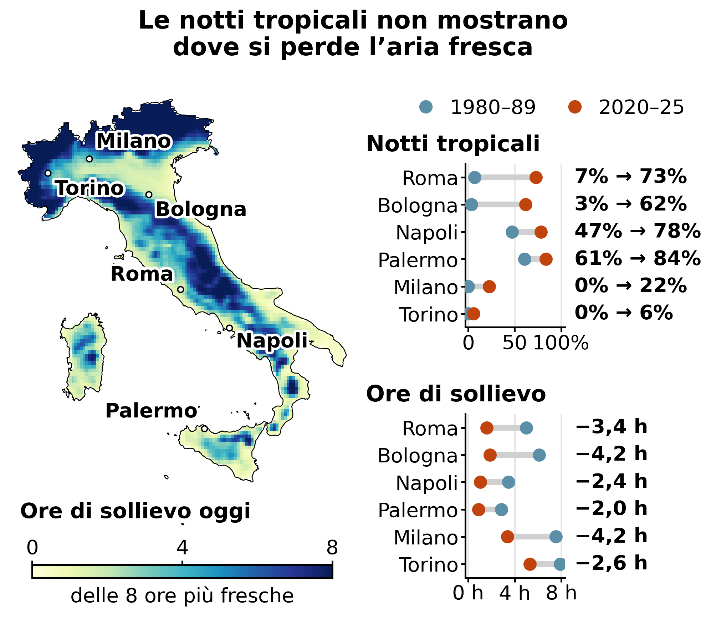
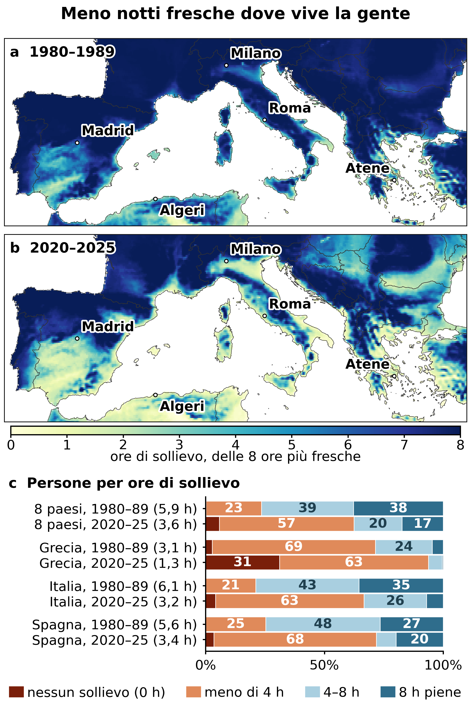

<!-- BIT · tropical-nights · it · 2026-10-05 -->

# L'Europa meridionale ha smesso di rinfrescarsi di notte

> **BIT VERDETTO #001**
> 
> - **L'affermazione:** le notti dell'Europa meridionale hanno smesso di rinfrescarsi.
> - **Il limite:** l'indicatore standard — le notti tropicali — è un conteggio sì-o-no. Registra una notte solo quando ha perso la sua ultima ora fresca: una notte che si rinfresca per un'ora e una fresca fino all'alba valgono lo stesso.
> - **La realtà:** misurare invece le ore di sollievo mostra che la pianura del Nord — Milano, Bologna — perde più aria fresca notturna delle coste del Sud, e quantifica la perdita per l'abitante medio dell'Europa meridionale in **2,3 ore a notte, mezz'ora in più o in meno — da 5,9 a 3,6 su otto possibili — l'equivalente di 26 notti fresche piene ogni estate**.

*Le notti calde hanno un costo sanitario proprio, distinto da quello del giorno — e il numero con cui le contiamo sta silenziosamente smettendo di funzionare. L'articolo parte dall'Italia e si allarga ai paesi UE dell'Europa meridionale; la stessa verifica si può rifare ovunque arrivi ERA5-Land.*

---

## BIG — le notti hanno smesso di rinfrescarsi

Da uomo di corporatura robusta, con un'insonnia leggera e una pessima sopportazione del caldo, per me questa non è scienza astratta. Quest'estate ho passato un mese a dormire tranquillo senza aria condizionata a Troina, un paese di montagna in Sicilia, mentre la mia famiglia sopportava ondate di calore senza tregua a casa, a Crema, non lontano da Milano, nel cuore della Pianura Padana. Quel contrasto si è rivelato una finestra su uno spostamento regionale, e misurarlo è ciò che fa questo articolo.

Le notti insopportabilmente calde che abbiamo vissuto quest'estate nell'Europa meridionale hanno un nome: notti tropicali. Si definisce notte tropicale quella in cui la temperatura non scende mai sotto i 20 °C. Suona come un dépliant di viaggi. Non lo è. Il corpo abbassa la propria temperatura interna per addormentarsi e per restare addormentato, e lo fa cedendo calore all'aria intorno. Quando l'aria resta sopra i 20 °C per tutta la notte, quel meccanismo si inceppa. Non ci si riprende dal caldo del giorno. Le ricerche sulle ondate di calore lo confermano: una notte calda fa male alla salute di per sé, non solo come coda di una giornata calda. Per questo le allerte per il caldo guardano anche alle notti — dopo una giornata calda, una notte fresca permette al corpo di riprendersi, una notte calda no.

Ecco dunque la mia osservazione empirica. Ho preso i dati pubblici di ERA5-Land, la rianalisi europea che ricostruisce il tempo passato su una griglia da 9 km, e ho confrontato le estati 2020–2025, da giugno ad agosto (escludendo quindi quest'ultima estate folle), con quelle 1980–1989 su tutta l'Italia. Il periodo di riferimento è arbitrario: sono nato nel 1983 e volevo confrontare con la mia infanzia. Si dà il caso che coincida con l'impostazione di pubblicazioni scientifiche recenti. Un'avvertenza va messa accanto a ogni numero che segue: ERA5-Land modella campi, non asfalto, quindi non contiene l'isola di calore urbana, e ogni cifra qui è un minimo.

*Figura 1 — Italia, percentuale dell'estate in cui la notte media resta sopra i 20 °C. A sinistra: 1980–1989. A destra: 2020–2025. ERA5-Land, griglia 9 km, giugno–agosto.*

> **I NUMERI**
> 
> - **6% → 33%** — la parte d'Italia in cui la notte estiva tipica resta ormai sopra i 20 °C
> - **73%** — la parte dell'estate che oggi a Roma è fatta di notti tropicali; negli anni Ottanta era il 7%
> - **28%** — la parte dell'estate che la zona attorno a Crema passa oggi in notti tropicali; per Troina è il 6%, ed erano entrambe allo 0% negli anni Ottanta

Negli anni Ottanta **il 6% dell'Italia** aveva una notte estiva tipica che restava sopra i 20 °C. Oggi è il **33%**. Un terzo del Paese. Roma è passata dal 7% dell'estate al 73% — cinque notti a settimana. Milano, che non ne aveva nessuna, oggi è al 22%, circa una settimana per ogni mese estivo.

I dati danno ragione all'aneddoto. Negli anni Ottanta né la zona attorno a Troina né quella attorno a Crema avevano notti tropicali; oggi Crema ne passa il **28%** dell'estate, Troina il 6%. Ma un conteggio di notti tropicali registra una notte solo quando resta calda fino in fondo — ed è lì che il numero ha smesso di funzionare.

## IF — il numero che usiamo diventa cieco

Una notte tropicale è una cosa sì-o-no. O la notte è scesa sotto i 20 °C a un certo punto, oppure no. Così una notte che si rinfresca appena per un'ora prima dell'alba e una notte fresca da mezzanotte al mattino contano entrambe come «non tropicali» — eppure la seconda regala una buona notte e la prima quasi niente. Questo conteggio registra una notte solo quando ha perso la sua ultima ora fresca; tutto quello che succede prima non viene registrato.

Ho usato allora una misura più semplice. Si prendono le otto ore più fredde del giorno — grosso modo la finestra in cui si dorme. Si conta quante restano sotto i 20 °C. Chiamiamole ore di sollievo. Otto è una buona notte; zero è una notte tropicale. Nel mezzo non si butta via niente. Misura la disponibilità di aria fresca, non il sonno; nessuno, in questo articolo, ha misurato quanto abbia dormito qualcuno.

Lo stesso punto cieco si vede nel tempo. Siccome il conteggio delle notti tropicali registra una notte solo quando ha perso l'ultima ora fresca, non vede i cambiamenti che si fermano prima. Dagli anni Ottanta le notti tropicali di Roma sono passate dal 7% dell'estate al 73%, quelle di Milano solo da zero al 22%. Eppure Milano ha perso più ore fresche: 4,2 a notte, contro le 3,4 di Roma. Le notti milanesi sono passate dall'essere fresche quasi per intero a esserlo per meno della metà, e quasi niente di tutto questo rientra tra le notti tropicali. La stessa misura dà un numero all'aneddoto: negli anni Ottanta le zone attorno a Troina e Crema avevano quasi le stesse ore fresche, meno di un'ora di differenza; oggi Crema ne ha 3,3 in meno a notte rispetto a Troina.

*Figura 2 — A sinistra: le ore di sollievo in Italia oggi (2020–2025). A destra, Notti tropicali: in sei delle maggiori città italiane, la percentuale dell’estate con notti tropicali, nel 1980–1989 (blu) e oggi (rosso); Ore di sollievo: le stesse città, con il sollievo perduto stampato a destra di ogni riga. Le città sono ordinate per quanto sono cresciute le loro notti tropicali. ERA5-Land, giugno–agosto.*

> **IL PARADOSSO DELLA PIANURA PADANA**
> 
> - **Roma —** notti tropicali dal 7% dell'estate negli anni Ottanta al 73% di oggi. Sollievo perduto: **3,4 ore** a notte.
> - **Milano —** notti tropicali da zero al 22% dell'estate. Sollievo perduto: **4,2 ore** — più di Roma.
> - **Torino —** notti tropicali da zero al 6% dell'estate, quasi nessun cambiamento — eppure ha perso **2,6 ore** di sollievo a notte.
> - **In sintesi —** il conteggio vede le notti che superano la soglia e non vede quelle che si svuotano sotto di essa. Le due misure concordano che Roma e Bologna sono cambiate molto; si separano su Milano e Torino, dove il conteggio delle notti tropicali si è mosso appena mentre le ore fresche si esaurivano. Negli anni Ottanta la Pianura Padana si rinfrescava per bene di notte; adesso non più.

Ma non sarà tutto un artefatto dei dati che ho raccolto, un modello grossolano da 9 km?

> **COSA DICE LA LETTERATURA**
> 
> - Vavassori, Žgela e Brovelli (*Applied Geomatics*, 2026) hanno affrontato la stessa domanda sull'Italia con una rianalisi da 2,2 km — venti volte più fine della mia — insieme a oltre 100 stazioni con controllo di qualità della rete sinottica dell'Aeronautica Militare, per il 1981–2024. Fra tutti gli indicatori di caldo che hanno testato, le notti tropicali sono quelle cresciute più in fretta: circa 6–7 giorni per decennio, con l'aumento più ripido sotto i 500 m, nelle pianure dove vive la maggior parte della gente. Griglia più fine, termometri veri, stessa direzione. Quello che *non* è, è una verifica del confronto specifico di questo articolo: loro stimano un trend continuo su 44 anni invece di contrapporre due decenni, e coprono la sola Italia. Conferma il fenomeno, non la mia aritmetica.

## TRUE — e non è solo l'Italia

Se questo crollo del raffreddamento notturno sta prendendo piede in Italia, dovremmo ritrovarlo lungo tutto l'arco nord del Mediterraneo. E infatti è così — e pesando ogni cella della griglia per il numero di persone che ci vivono, con la griglia statistica Eurostat, possiamo quantificare cosa significhi lo spostamento per le persone e non per il territorio. L'altitudine aiuta ancora; il guaio è che la gente vive soprattutto in pianura.

*Figura 3 — (a, b) Le ore di sollievo su tutto il riquadro, 1980–1989 e 2020–2025, per ogni cella di terra coperta da ERA5-Land (giugno–agosto). (c) Gli otto paesi UE dell’Europa meridionale insieme, e Grecia, Italia e Spagna: la popolazione divisa in quattro fasce per ore di sollievo, pesata con la griglia del censimento Eurostat 2021 (GISCO, 5 km); ogni etichetta riporta le ore medie a persona. La fascia rosso scuro all’inizio di ogni barra è la popolazione in notte tropicale — le persone la cui notte estiva media non scende mai sotto i 20 °C.*

La persona media in Italia ha perso **2,8 ore** di aria fresca notturna, passando da 6,1 ore a notte a 3,2 — detto al contrario, l'Italia conserva circa metà di quel che aveva. In Spagna la perdita è di **2,2 ore**, da 5,6 a 3,4. In Grecia è di **1,8 ore** — e i greci oggi hanno in media appena **1,3 ore** a notte, contro 3,1. La Grecia è il punto in cui la scala finisce: la sua perdita sembra minore di quella italiana solo perché partiva da pochissimo, e non si può perdere ciò che non si è mai avuto. Sei estati contro dieci sono un campione piccolo, quindi la perdita di ciascun paese potrebbe spostarsi fino a circa tre quarti d'ora in più o in meno: che l'Italia perda più di tutti regge comunque, mentre chi fra Spagna e Grecia abbia perso di più no.

Negli anni Ottanta **quattro italiani su cinque** avevano almeno quattro ore di sollievo (Figura 3, pannello c). Oggi **due su tre ne hanno meno di quattro**. In Grecia il **31% della popolazione** — una persona su tre — vive dove la notte estiva media è una vera notte tropicale: non scende mai sotto i 20 °C. Negli anni Ottanta era il 3%.

Allargando agli otto Stati membri UE dell'Europa meridionale interamente coperti dalla griglia censuaria Eurostat — Portogallo, Spagna, Italia, Malta, Slovenia, Croazia, Grecia e Bulgaria — il quadro tiene. L'abitante medio dell'Europa meridionale è passato da 5,9 ore di sollievo a notte a 3,6: una perdita di 2,3 ore a persona, su 135 milioni di persone.

Detto al contrario, l'Europa meridionale conserva tre ore di aria fresca su cinque di quelle che aveva. Gli abitanti dell'Europa meridionale con meno di quattro ore sono passati da circa uno su quattro a più di tre su cinque. Quelli che ne hanno ancora otto piene si sono più che dimezzati, da quasi due su cinque a circa uno su sei.

> **I NUMERI**
> 
> - **5,9 → 3,6 ore** — l'aria fresca notturna che tocca a un abitante dell'Europa meridionale, su otto possibili
> - **26 notti** — notti fresche piene perse a persona, ogni estate — quasi un terzo dell'estate (fra 20 e 32)
> - **308 milioni di ore-persona** — la stessa perdita sommata su 135 milioni di persone, ogni notte d'estate
> - **7% delle notti di una vita** — quanto valgono le notti fresche perse, se il ritmo non aumentasse mai più (fra circa il 6% e il 9%)

Le mappe mostrano il bacino più ampio — Nord Africa, Turchia e Balcani compresi — perché il calore atmosferico non si ferma ai confini nazionali. Quelle regioni sono però escluse dai totali aggregati, perché la griglia censuaria dell'UE non le copre.

L'ho detto all'inizio: dormo male. In una notte che si raffredda appena — come quelle che ha ormai Crema — una persona insonne come me rischia di addormentarsi alle 4 e svegliarsi alle 7. La mia risposta, quest'estate, è stata scappare dalla pianura fino a Troina: un privilegio, non un piano, perché la maggior parte delle persone non può partire. Per loro la risposta è l'aria condizionata, che raffredda la stanza spingendone il calore nella strada, e [consuma elettricità per farlo](https://doi.org/10.1787/9789264301993-en), in buona parte ancora prodotta bruciando combustibili fossili — scalda il quartiere stanotte e il clima per le estati a venire. Il rimedio a una notte calda alimenta la successiva. I numeri di questo articolo riguardano l'aria fresca, non il riposo. Ma è in questo che si trasformano le ore di sollievo che mancano, una notte alla volta, per chi era già sveglio.

Dormire male lascia tempo per le domande. Ho scelto proprio questa, e il lavoro l'ha fatto Claude, dagli script per scaricare i dati all'ultima mappa, mentre io lo rimandavo indietro ogni volta che un numero non mi tornava; [codice e dati](https://github.com/bigiftruebits/bit-001-tropical-nights) sono lì perché possiate fare lo stesso. Chi legge per curiosità può fermarsi qui: quello che segue è la parte con cui si chiude ogni uscita di questa newsletter, tutto il lavoro mostrato invece di chiedere fiducia, come spiego in [un breve manifesto](https://bigiftruebits.substack.com/p/manifesto).

---

## Cosa è e cosa non è

- Questa è disponibilità di aria fresca, non sonno. Nessuno ha misurato quanto abbia dormito qualcuno. Ciò che è cambiato è se esistano o no le condizioni per dormire bene.
- Il confronto è fra 2020–2025 (sei estati) e 1980–1989 (dieci estati), da giugno ad agosto. Sei anni sono un riferimento recente breve; il riscaldamento porta con sé circa ±0,7 °C di incertezza di campionamento in Italia e Spagna, e ±0,9 °C in Grecia.
- Per estate qui si intende da giugno ad agosto, l'estate meteorologica standard, applicata allo stesso modo ai due decenni. È la finestra giusta per la parte più calda dell'anno: giugno si è scaldato più di ogni altro mese, di circa 3,2 °C, e settembre meno di tutti, di circa 1,0 °C, così oggi giugno è circa 2 °C più caldo di settembre, mentre negli anni Ottanta i due si equivalevano. Ma il mare resta caldo fino a settembre, e le notti sulla costa seguono il mare: escludere settembre può sottostimare il caldo notturno lungo le coste. Le notti di settembre non sono state analizzate; verificarle mostrerebbe se la stagione delle notti calde ormai va oltre l'estate di calendario.
- Ogni valore qui descrive una cella della griglia di circa 9 km di lato — la zona attorno a un luogo, non il suo centro. Per questo ogni città citata è stata confrontata con le celle attorno. La maggior parte regge: Roma, Milano, Napoli, Bari e Crema cambiano appena entro 15 km. Genova no. La sua cella è mare, e le celle di terra vicine vanno da meno di 2 ore di sollievo sulla costa a 8 piene nelle colline alle spalle, quindi resta fuori dalla Figura 2 invece di essere rappresentata da una collina. Anche attorno a Troina il terreno è ripido: il paese sta dentro la propria cella, e le celle a nord e a ovest concordano con essa, ma quella cella media il paese sul crinale insieme ai terreni più bassi attorno, e una griglia da 9 km non può dire se il paese stesso di notte sia più fresco o più caldo. Differenze fra città di circa mezz'ora o meno rientrano in questa incertezza e non sono trattate come risultati.
- Anche le ore di sollievo hanno un tetto. Quando nessuna delle otto ore più fresche scende sotto i 20 °C, la misura segna zero, che la notte resti a 21 °C o a 27 °C — ed è ormai il caso di circa un terzo dei greci. Misura bene la perdita di aria fresca, ma non sa ordinare quanto siano diventate calde le notti più calde: per quello servirebbe una misura di quanto restano sopra i 20 °C.
- «Percentuale dell'estate» qui significa la percentuale di mesi estivi la cui notte media è tropicale — non un conteggio di singole notti. I conteggi reali di notti tropicali sono più alti, perché le singole notti calde superano la media mensile.
- In ERA5-Land non ci sono città. Modella campi, non asfalto, quindi non contiene l'isola di calore urbana. Milano, Roma, Madrid e Atene vere sono più calde di notte di quanto si veda qui. Ogni numero di questo articolo è un minimo.
- L'aggregato da 135 milioni copre Portogallo, Spagna, Italia, Malta, Slovenia, Croazia, Grecia e Bulgaria. Francia, Austria, Romania, Ungheria e Svizzera sono tagliate dal margine nord della mappa, quindi includerle vorrebbe dire mediare su mezzo paese; i Balcani non UE e il Nord Africa non hanno una griglia censuaria comparabile. Malta poggia su due celle della griglia e va letta come indicativa, non precisa.

> **BIT — LE CARTE IN TAVOLA**
> 
> - **Modello e codice —** ogni script di questa analisi, dal download dei dati alle giunzioni spaziali e alle statistiche fino ai grafici, è stato scritto da Claude (Anthropic), a partire dalle mie istruzioni; io ho posto le domande e scelto l'inquadratura. L'analisi e la scrittura sono state fatte in una normale chat di Claude fra agosto e ottobre 2026, cominciata con **Claude Opus 5** e finita con **Claude Opus 5.5** — il momento del passaggio non è stato registrato. Una chat di Claude distinta ha rivisto il testo secondo il formato della serie, e il repository pubblico è stato preparato in Claude Code, quasi interamente da **Claude Sonnet 5.5**. I download dei dati sono stati eseguiti sul mio computer.
> - **Utilizzo —** contato per la preparazione del repository pubblico e del suo archivio, svolta in Claude Code: 3,5 milioni di token effettivi (Sonnet 5.5 3,47M, Opus 5.5 0,07M), circa 7 $ a prezzo di listino. Non contato: l’analisi e la scrittura, svolte in una normale chat di Claude che non riporta i token, e la revisione secondo il formato della serie, svolta in un’altra chat. [Il conteggio completo è nel repository](https://github.com/bigiftruebits/bit-001-tropical-nights/blob/main/USAGE.md).
> - **Errori trovati e corretti durante il lavoro —** un errore di array mascherato che trasformava silenziosamente ogni cella di mare in uno zero dall'aria credibile; un errore di confine nazionale che faceva entrare il 29% di territorio straniero nei dati «italiani»; celle di popolazione che scivolavano su pixel di mare facendo perdere il 10–16% dei residenti costieri; una soglia arbitraria di quattro ore, abbandonata una volta verificata l'intera sensibilità; un'apparente struttura oraria che si è rivelata un artefatto della rianalisi, scoperta perché compariva alla stessa ora d'orologio in tre paesi distribuiti su un'ora di tempo solare; una città la cui cella risultava essere mare, e che veniva quindi rappresentata da una collina 11 km nell'entroterra; e, in revisione, diverse affermazioni dell'argomentazione stessa che non hanno retto alla verifica; [il registro completo è nel repository](https://github.com/bigiftruebits/bit-001-tropical-nights/blob/main/NOTES.md). Ognuno è stato trovato. Non posso promettere che non ne resti nessuno.
> - **Fonti dei dati —** medie mensili per ora del giorno di ERA5-Land (Copernicus Climate Change Service, CC BY; [doi:10.24381/cds.68d2bb30](https://doi.org/10.24381/cds.68d2bb30); descritte in Muñoz-Sabater et al., Earth System Science Data 13, 2021, [doi:10.5194/essd-13-4349-2021](https://doi.org/10.5194/essd-13-4349-2021)); griglia del censimento Eurostat 2021 (GISCO, 5 km; CC BY 4.0, © Unione europea, Eurostat; [ec.europa.eu/eurostat/web/gisco/geodata/grids](https://ec.europa.eu/eurostat/web/gisco/geodata/grids)); confini dei paesi (Natural Earth, pubblico dominio; [naturalearthdata.com](https://www.naturalearthdata.com/)).
> - **Studi peer-reviewed correlati —** Vavassori, Žgela & Brovelli, Applied Geomatics 18:84 (2026), [doi:10.1007/s12518-026-00734-x](https://doi.org/10.1007/s12518-026-00734-x): sull’Italia, con una rianalisi più fine e stazioni meteo, le notti tropicali sono l’indicatore di caldo cresciuto più in fretta — la stessa direzione, come trend su 44 anni invece del confronto fra due decenni di questo articolo. Su questioni vicine, Murage, Hajat & Kovats, Environmental Epidemiology (2017), [doi:10.1097/EE9.0000000000000005](https://doi.org/10.1097/EE9.0000000000000005), e Kim et al., Environmental Health Perspectives 131 (2023), [doi:10.1289/EHP11444](https://doi.org/10.1289/EHP11444), trovano che le notti calde aumentano la mortalità indipendentemente dal caldo del giorno; de Munck et al., International Journal of Climatology 33 (2013), [doi:10.1002/joc.3415](https://doi.org/10.1002/joc.3415), e Salamanca et al., Journal of Geophysical Research: Atmospheres 119 (2014), [doi:10.1002/2013JD021225](https://doi.org/10.1002/2013JD021225), trovano che il calore di scarto dei condizionatori scalda le strade, soprattutto di notte. Entrambi concordano con le affermazioni che qui sostengono.
> - **Codice e dati —** [github.com/bigiftruebits/bit-001-tropical-nights](https://github.com/bigiftruebits/bit-001-tropical-nights); archiviati, codice e dati insieme, su [doi:10.5281/zenodo.23158810](https://doi.org/10.5281/zenodo.23158810). A partire dai soli dati condivisi, tutte le 68 verifiche riproducono i valori pubblicati e ogni figura si ridisegna.
> - **Come citarlo —** Questo non è un articolo sottoposto a revisione scientifica. Se ti serve comunque citarlo, cita il codice e i dati archiviati: Gallotti, R. (2026). BIG IF TRUE #001: L’Europa meridionale ha smesso di rinfrescarsi di notte [Codice e dati]. Zenodo. [https://doi.org/10.5281/zenodo.23158810](https://doi.org/10.5281/zenodo.23158810)

*Preferisco che qualcuno trovi un errore piuttosto che nessuno guardi. [Codice e dati](https://github.com/bigiftruebits/bit-001-tropical-nights) sono aperti, e pubblicati con ogni uscita.*
